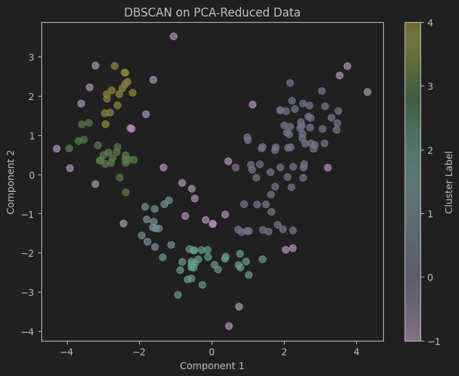
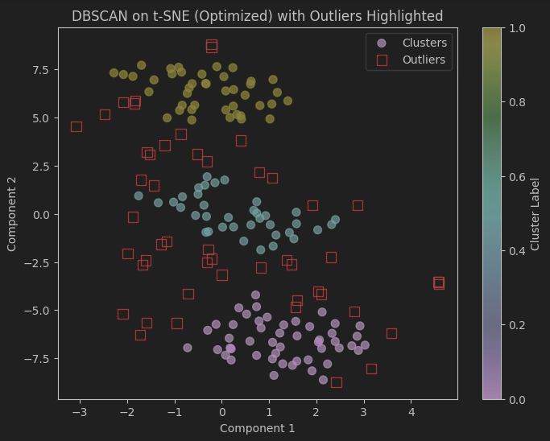

# Dimensionality Reduction + Clustering on the Wine Dataset

A simple yet powerful pipeline demonstrating how **PCA** and **t-SNE** can be combined with **DBSCAN** and **KMeans** clustering to uncover patterns in the [Wine dataset](https://scikit-learn.org/stable/modules/generated/sklearn.datasets.load_wine.html).

---

## Table of Contents
- [Dimensionality Reduction + Clustering on the Wine Dataset](#dimensionality-reduction--clustering-on-the-wine-dataset)
  - [Table of Contents](#table-of-contents)
  - [Introduction](#introduction)
  - [Project Structure](#project-structure)
  - [Dependencies](#dependencies)
  - [Installation](#installation)
  - [Usage](#usage)
  - [Pipeline Details](#pipeline-details)
    - [1. Data Loading](#1-data-loading)
    - [2. Preprocessing](#2-preprocessing)
    - [3. Dimensionality Reduction](#3-dimensionality-reduction)
    - [4. Clustering](#4-clustering)
    - [5. Evaluation](#5-evaluation)
    - [6. Parameter Tuning](#6-parameter-tuning)
  - [Results](#results)
    - [Visualizations](#visualizations)
    - [Example Scores](#example-scores)
  - [Future Work](#future-work)
  - [References](#references)

---

## Introduction
In this project, we explore **unsupervised clustering** after applying **dimensionality reduction** techniques. We focus on:

- **PCA** for linear dimensionality reduction.
- **t-SNE** for nonlinear manifold learning.
- **DBSCAN** for density-based clustering.
- **KMeans** for centroid-based clustering.

We evaluate the resulting clusters using **Silhouette Score**, **Calinski-Harabasz**, and **Davies-Bouldin** indices.

---

## Project Structure
```bash
my_project/
├── notebook.ipynb         # Jupyter Notebook with the full pipeline
├── requirements.txt        # Minimal dependencies
├── README.md               # This README file
└── ...
```

- **`notebook.ipynb`** contains all the code, divided into logical sections:
  1. **Imports** and environment setup
  2. **Data Loading** (Wine dataset via scikit-learn)
  3. **Scaling/Preprocessing**
  4. **t-SNE & DBSCAN Parameter Tuning**
  5. **Applying PCA, t-SNE**
  6. **Clustering** (DBSCAN, KMeans)
  7. **Evaluation** (Silhouette, Calinski-Harabasz, Davies-Bouldin)
  8. **Visualizations** (scatter plots, outlier highlighting, bar charts)

---

## Dependencies

This project primarily requires:
- **Python** 3.7+
- [NumPy](https://numpy.org/)  
- [Pandas](https://pandas.pydata.org/)  
- [Matplotlib](https://matplotlib.org/)  
- [Seaborn](https://seaborn.pydata.org/)  
- [scikit-learn](https://scikit-learn.org/stable/)  
- [Jupyter](https://jupyter.org/) (for running the notebook)

See the provided **`requirements.txt`** for exact pinned versions.

---

## Installation

1. **Clone** or download this repository:
   ```bash
   git clone https://github.com/DavidVuescu/Dimensionality-Reduction-and-Clustering.git
   cd Dimensionality-Reduction-and-Clustering
   ```
2. **Create and activate a virtual environment**:
   ```bash
   python -m venv venv
    source venv/bin/activate        # Mac/Linux
    # or:
    venv\Scripts\activate           # Windows
   ```
3. **Install** the required dependencies:
   ```bash
   pip install -r requirements.txt
   ```

---

## Usage

1. **Launch** the Jupyter Notebook server:
   ```bash
   jupyter notebook
   ```
   or
   ```bash
   jupyter lab
   ```
2. **Open** **`notebook.ipynb`** in your browser.
3. **Run** each cell from top to bottom to reproduce the results.

If you encounter any “module not found” errors, ensure you have the correct environment activated and installed all dependencies from the **`requirements.txt`**.

---

## Pipeline Details

### 1. Data Loading
We use the `load_wine()` function from [scikit-learn](https://scikit-learn.org/stable/modules/generated/sklearn.datasets.load_wine.html) to load 178 samples of wine, each with 13 numeric features. A `target` column indicates the wine class (0, 1, or 2).

### 2. Preprocessing
All numeric features are **standardized** (mean = 0, std = 1) using `StandardScaler`. This helps distance‐based methods like DBSCAN or KMeans perform better.

### 3. Dimensionality Reduction
- **PCA**: Projects data onto principal components, capturing maximum variance in fewer dimensions.
- **t-SNE**: A nonlinear method emphasizing local neighborhoods, often used for visualization in 2D.

### 4. Clustering
- **DBSCAN**: Clusters points based on density, labeling outliers as `-1`.
- **KMeans**: Groups points around `k` centroids; here we pick `k=3` to match the original number of wine classes.

### 5. Evaluation
We measure:
1. **Silhouette Score** (`silhouette_score`)  
2. **Calinski-Harabasz Index** (`calinski_harabasz_score`)  
3. **Davies-Bouldin Index** (`davies_bouldin_score`)

**Note**: Some metrics are undefined if only one cluster is formed.

### 6. Parameter Tuning
We systematically search different **perplexities** and **iterations** for t-SNE, along with **eps** and **min_samples** for DBSCAN, maximizing Silhouette Score. The best combination is used for a final run of t-SNE + DBSCAN.

---

## Results

### Visualizations
Below are some example plots generated by the notebook (placeholders shown here—modify as needed):

  
*Figure 1: 2D PCA representation of the Wine dataset with clusters.*

  
*Figure 2: 2D t-SNE representation of the Wine dataset with DBSCAN clusters (outliers in red squares).*

### Example Scores
Here is a sample table showcasing results from **DBSCAN** and **KMeans** on raw vs. PCA vs. t-SNE embeddings. These exact numbers may differ based on parameter settings:

| Clustering | Raw Data        | PCA (2D)         | t-SNE (Optimized) |
|------------|-----------------|------------------|-------------------|
| DBSCAN     | N/A or 1 cluster (no score) | 0.48 (Silhouette) | 0.52 (Silhouette) |
| KMeans     | 0.44 (Silhouette)           | 0.58 (Silhouette) | 0.55 (Silhouette) |

**Outlier Analysis**: DBSCAN might label several points as `-1`. The scatter plots can highlight these visually.

---

## Future Work

- **Try Additional Methods**: HDBSCAN, OPTICS, or UMAP for dimension reduction.
- **Larger Datasets**: Evaluate how well the pipeline scales.
- **Outlier Analysis**: Investigate DBSCAN-labeled outliers more closely.
- **Hyperparameter Search**: Extend beyond Silhouette Score (e.g., grid search or Bayesian optimization).

---

## References

- **Scikit-learn** docs on [DBSCAN](https://scikit-learn.org/stable/modules/generated/sklearn.cluster.DBSCAN.html), [KMeans](https://scikit-learn.org/stable/modules/generated/sklearn.cluster.KMeans.html), [PCA](https://scikit-learn.org/stable/modules/generated/sklearn.decomposition.PCA.html), and [t-SNE](https://scikit-learn.org/stable/modules/generated/sklearn.manifold.TSNE.html).
- **Wine Dataset**: [UCI Machine Learning Repository](https://archive.ics.uci.edu/ml/datasets/Wine).  
- **Clustering Evaluation**: [Scikit-learn Clustering Metrics](https://scikit-learn.org/stable/modules/clustering.html#clustering-evaluation).

---

**Thank you** for checking out my project! If you have any questions or suggestions, feel free to shoot me a mail, open an issue, or submit a pull request.
